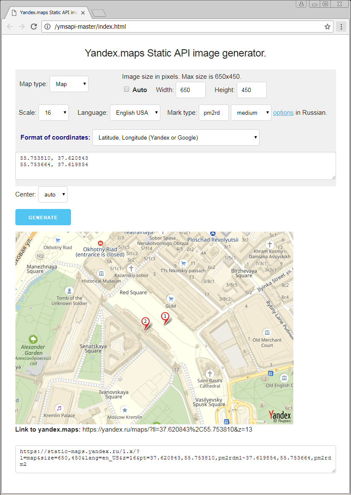

# Yandex.maps Static API image generator
This is a JQuery scpirt for a Yandex.maps Static API. It allows you to generate images based on your marks (coordinates).
It was designed to work with a Microsoft excel output but it's possible to copy-paste coordinates from Google or Yandex maps.  

